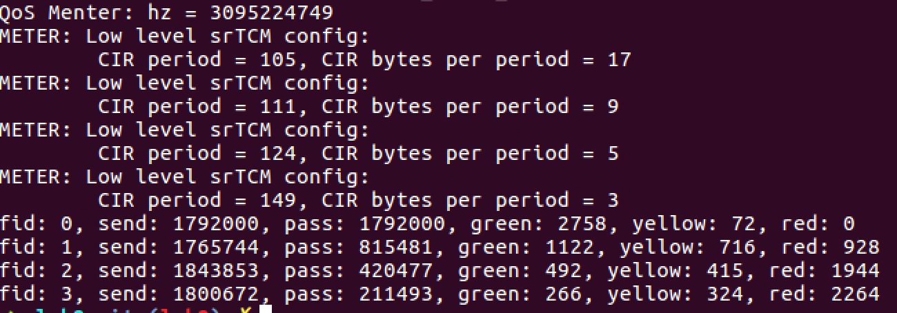
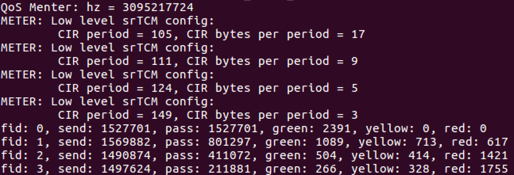
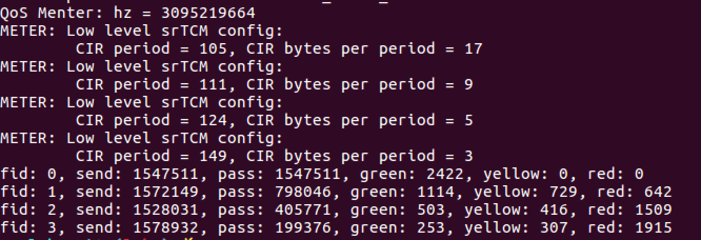
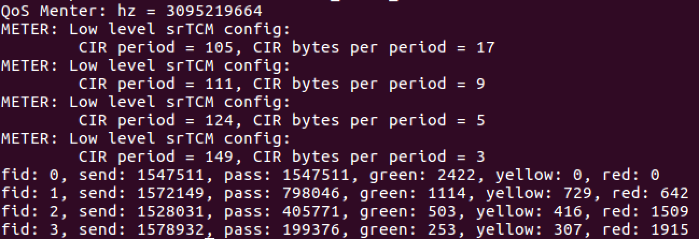
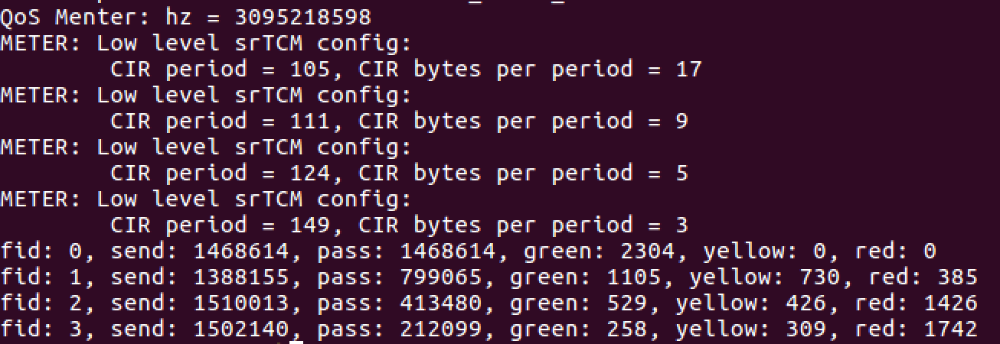

# QoS Implementation with DPDK

515030910223
杨健邦

### 使用的DPDK API

1. Meter
  ```c
  int
  rte_meter_srtcm_config(struct rte_meter_srtcm *m,
    struct rte_meter_srtcm_params *params); 
  ```
  
  - 初始化每个流的srtcm的runtime data，srtcm每个流一个。
  
  ```c
  static inline enum rte_meter_color
  rte_meter_srtcm_color_blind_check(struct rte_meter_srtcm *m,
    uint64_t time,
    uint32_t pkt_len);
  ```

  - 给到来的每一个包染色，传入的srtcm为每个流对应的runtime data。
  - **要注意的是，从main中传入的time的单位是ns，而此API接受的time的单位是cpu cycles，要通过CPU的频率计算将time的单位转换**
  - **还要注意的是，这里的time并不是从0开始记的，在上面config的时候，rte记录了一次当前的时间(单位为cycle)，因此还要加上一个偏移量**

2. Dropper
 ```c
 int
 rte_red_config_init(struct rte_red_config *red_cfg,
    const uint16_t wq_log2,
    const uint16_t min_th,
    const uint16_t max_th,
    const uint16_t maxp_inv);
 ```

 - 初始化config， config每个流的每一种颜色都要一个， 一共4 * 3 = 12个。

 ```c
 int
 rte_red_rt_data_init(struct rte_red *red);
 ```

 - 初始化dropper的runtime data， 也是12个。

```c
 static inline int
 rte_red_enqueue(const struct rte_red_config *red_cfg,
    struct rte_red *red,
    const unsigned q,
    const uint64_t time);
```

 - 对于每一个到来的包， 判断其是否需要被丢弃。 **注意: 这里的q为每一个流一个(DPDK上面文档有说明，流与流之间不应该相互影响)， 单位为packets， 每一个period(1,000,000nm)清空一次。**
 - **根据源代码，这里的time的单位应该是Byte，这里的time只是用作timestamp的功能，并不是精确计时，而且根据现在的接口也不知道发了多少个Byte，因此这里将cpu cycles作为timestamp传入即可。**

### 参数理解
- Meter
```c
/* srtcm 每个参数的说明以及作用：
 *  cir:
 *      - 承诺访问速率,每秒钟往C桶和E桶填充新令牌的速率,一个令牌相当于一个Byte
 *      - 单位 Byte/s
 *  cbs:
 *     - C桶容量
 *     - 增大的话,承受burst的能力增强
 *     - 单位 Byte
 *  ebs:
 *     - E桶容量
 *     - 增大的话,承受burst的能力增强
 *     - 单位 Byte
 */
```

- Dropper
```c
/*
 * WRED 每个参数的说明以及作用：
 *  min_th:
 *      - 小队列长度,当队列小于该长度时,不会丢包,在min和max之间开始丢包，丢包可能性随q增大而增大，最大丢包可能性为maxp
 *  max_th:
 *      - 最大队列长度,当队列大于该长度时,丢包率为100%
 *  maxp_inv:
 *      - 队列长度在min和max之间时最大的丢包可能性, 10表示, 10个包中有1个包会丢
 *  wq_log2:
 *      - 决定平均队列长度变化速率的快慢,同一种流的wq_log2的值要相同。
 */
```

### Meter的调参过程
 1. 通过调用rte_get_tsc_hz()， 可知道虚拟机CPU的HZ为3,095,221,586, 也就是说每秒中CPU运行3,095,221,586个cycle，这里的频率是用于后面时间单位的转换。

 2. meter将cir转换为cir_period和cir bytes per period， cir_period指的是每隔多少个cycles填充一次令牌桶，CIR bytes per period 指的是每个period填充多少个bytes。

 3. 通过计算main中发包速率，得出每隔1,000,000ns,平均每一个流要发(1000/4)Packets * 640 Bytes = 160,000, 即每秒每个流要发送160,000,000Bytes，这是FLOW 0 CIR的值。

 4. 对于FLOW 0，要让其获得最大带宽，则其可能的最大发包速率为(128+1024) * 1500 * 1000 = 1,728,000,000 Byte， cbs和ebs应该设得尽可能大，使其的包都染成绿色。

 5. 对于FLOW 1，其cir应为FLOW 0的一半， 调整cbs和ebs， 使得FLOW 1中被染成绿包的数量约等于FLOW 0绿包数量的一半偏少，黄包的数量和绿包差不多，剩下的的包都为红包。

 6. 同理， 其它流的设置也类似，逐次减半。

 7. **最后的结果是: 由于FLOW 0要达到最大带宽，所以FLOW 0全都是绿包，其它流的绿包数分别约为FLOW 0的绿包数的二分之一、四分之一、八分之一**

### Dropper的调参过程
 1. 【FLOW 0】由于FLOW 0可以得到最大带宽，所以其绿色包的min_th和max_th要调得尽可能大，分别为1022和1023，而丢包率要尽可能低，因此将maxp_inv设置为255, 255个包才会丢一个。这样的话，FLOW 0的绿包就已经基本不丢包了，而前面meter将FLOW 0的包基本都染成绿色，因此FLOW 0拥有最大带宽。
 

 2. 【FLOW 1-3的绿包】由于上面Meter的时候设置的绿包比差不多等于带宽比，因此对于其它流，绿包要尽可能地少丢即可，但是也不能不丢。所以将绿包的min_th设置为64左右，而将绿包的max_th设置为1023。**这样的话，绿包绝大部分都不会被丢掉**


 3. 【FLOW 1-3的黄包和红包】将FLOW1-3的黄包和红包丢包率比较大，方法是将红包和黄包的min_th和max_th设置得比较小(1-24左右)，同时maxp_inv也设置得比较小(1-4左右)，**这样的话，黄包和红包的大部分都被丢掉，但也保证黄包和红包不会全丢，黄包的丢包率比红包的丢包率小**。

 4. 【微调】剩下的工作就是细调, 使得四个流的带宽比为8:4:2:1


### 实际结果
- 平均每个流一共要发送1,600,000个Bytes，因此FLOW 0全部发送，不丢包，而FLOW 1约能发送800,000个Bytes, FLOW 2约能发送400,000个Bytes，FLOW 3 约能发送200,000个Bytes。测试结果符合作业要求。


- 测试1



- 测试2



- 测试3



- 测试4



- 测试5


